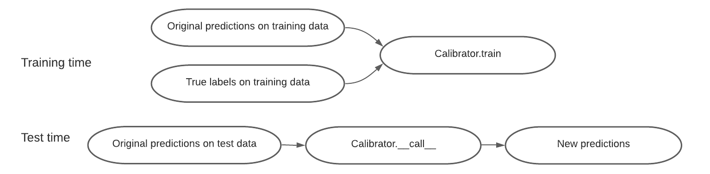

# Overview

This page contains an overview of the design philosophy and usage of TorchUQ.

The core of TorchUQ consists of the following three components: prediction types, evaluation metrics, and transformations.

## 1. Prediction types 

Before we start to work with any predictions we must think about how to represent our prediction. For example, when predicting the price of a house, we could represent it as a range, such as 120k-150k dollars, or we could represent it as a cumulative density function (CDF). TorchUQ supports around 10 different prediction types for regression and classification problems:

- For a list of types supported for regression problems, see [link] 

- For a list of types supported for classification problems, see [link] 

In the next major update, we intend to support additional prediction types, such as multi-variate predictions. 

## 2. Evaluation Metrics 

Given a prediction, we will want to evaluate how good it is at capturing the ground truth. In TorchUQ all evaluation functions are in the ```torchuq.evaluate```  sub-package, organized by prediction type. For example, functions that evaluate a categorical prediction are in the ```torchuq.evaluate.categorical``` sub-package, and functions that evaluate a distribution prediction are in the ```torchuq.evaluate.distribution``` sub-package.

There are two ways to evaluate predictions: by computing a metric (such as the L2 loss or the log-likelihood), or by a visualization plot (such as the reliability diagram). 

### 2.1 Computing a metric 

These functions compute a evaluation metric (such as L2 loss or ECE error) on a batch of predictions. All metric computation functions take the following format

``` torchuq.evaluate.{prediction_type}.compute_{metirc_name}(predictions, labels, reduction='mean')```

For example, to compute the ECE of a categorical prediction, use

```torchuq.evaluate.categorical.compute_ece(predictions, labels)```

Most metric evaluation functions take three arguments (but some may take more or less arguments)

- ```predictions```: the prediction that we would like to evaluate. Must have the correct type. For example, if we use a function in the module ```torchuq.evaluate.categorical``` then the prediction must have ```categorical``` type. 
- ```labels```: the true labels, not required for all functions. This should be an array of int for classification problems or an array of floats for regression problems.  
- ```reduction```: the str that decides how the computed metric is aggregated across the batch. This argument works in the same way as in pytorch. For example, the mean reduction indicates that we want to average the evaluation metrics. 

### 2.2 Make a plot

These functions make a plot to visualize the quality of the batch of predictions. 

``` torchuq.evaluate.{predition_type}.plot_{visualization_name}(predictions, labels, ax=None)```

For example, to compute the reliability diagram of a categorical prediction, use

```torchuq.evaluate.categorical.plot_reliability_diagram(predictions, labels)``` 

Most visualization functions take three arguments (but some may take more or less arguments)

- ```predictions, labels```: same as metric evaluation functions
- ```ax```: the matplotlib axes to make the figure on. If ```ax is None``` (recommended), then a new figure (of suitable size) will be created. If ```ax is not None``` then you should make sure the figure has the right size for visual appeal of the plot. 


## 3. Transformations

The final and key component of TorchUQ is transformation. We will want to transform low quality predictions (such as uncalibrated predictions) into new high quality predictions, usually with the help of some data. 

The main workhorse for transformation is the Calibrator abstract class, which defines a unified interface for an extremely large collection of calibration algorithms (including standard calibration algorithms, conformal prediction, decision calibration, multi-calibration, and many more).



A calibrator class has three main functions: 

1. ```Calibrator.__init__```(input_type='auto')

The initialization function can take optional arguments, but has only one required argument, which is the input type---it can be any of the prediction types in the previous section. 

2. ``` Calibrator.train(predictions, labels, side_feature=None) ```

The ```Calibrator.train``` function uses the training data to learn any parameters that is necessary to transform a low quality prediction into a high quality prediction. It takes as input a set of predictions and the corresponding labels. In addition, a few recalibration algorithms---such as group calibration or multicalibration---can take as input additional side features, and the transformation depends on the side feature. 

3. ```Calibrator.__call__(predictions, side_feature=None)```

To use the learned calibrator to transform new data, simply run ```Calibrator(new_prediction)```. Note that several calibrator can transform a prediction into a different type. For example, the ```ConformalCalibrator``` class takes as input an original prediction of any type, and outputs new predictions that are distributions.  


### Example

For example, to use temperature scaling to recalibrate a categorical prediction use 

```
calibrator = TemperatureScaling(verbose=True)
calibrator.train(predictions, labels)
predictions_ts = calibrator(predictions)
```


###  Online Prediction 

Finally many algorithms can be used in the online prediction setup, where data becomes available in a sequential order and can be used to update the best predictor for future data. This is achieved by 

```Calibrator.update(predictions, labels, side_feature=None) ```

This function works in the same way as ```calibrator.train```---except that instead of training the calibrator from scratch, it updates the calibrator with the new data. For an online prediction example see [link]. 

### Transformations Options

While the above discussion concerns transformations with data, TorchUQ also supports
direct transformations between types. For example, given a distribution prediction, we
can take the 95% credible interval as an interval prediction. The follow tables show the
options for direct transformations.

#### Transformations for regression prediction types

|              | Point  | Distribution | Interval | Quantile | Particle |
| :----------: | :----: | :----------: | :------: | :------: | :------: |
|    Point     |   -    |      No      |    No    |    No    |    No    |
| Distribution |  Yes   |      -       |   Yes    |   Yes    |   Yes    |
|   Interval   |  Yes   |      No      |    -     |    No    |    No    |
|   Quantile   | ->Dist |     Yes      |  ->Dist  |    -     |  ->Dist  |
|   Particle   | ->Dist |     Yes      |  ->Dist  |   Yes    |  ->Dist  |
|   Ensemble   | ->Dist |     Yes      |  ->Dist  |  ->Dist  |  ->Dist  |


#### Transformations for classification prediction types

|             | topk | categorical | uset |
| :---------: | :--: | :---------: | :--: |
|    topk     |  -   |             |      |
| categorical | Yes  |      -      | Yes  |
|    uset     |      |             |  -   |
|  ensemble   |      |             |      |
