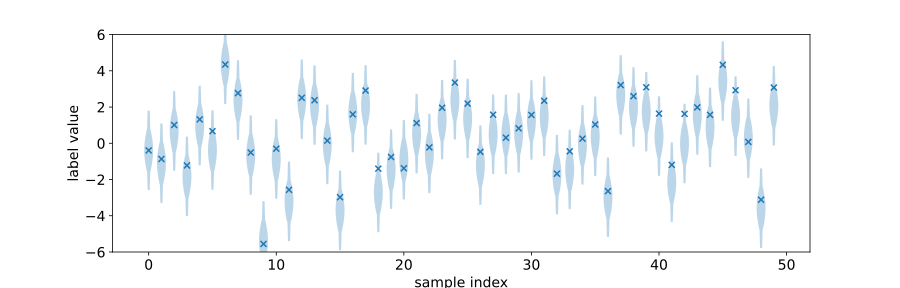
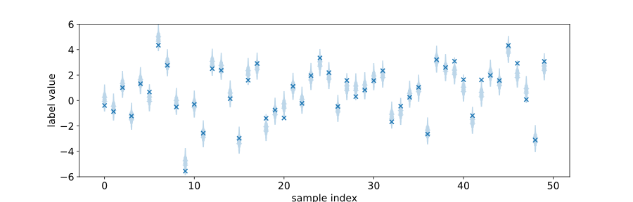

Quick Start
===========

.. code:: python

    import torch, torchuq
    from torchuq.evaluate import distribution 
    from torchuq.transform.conformal import ConformalCalibrator 
    from torchuq.dataset import create_example_regression 

In this very simple example, we create a synthetic prediction (which is
a set of Gaussian distributions), plot them, and recalibrate them with
conformal calibration.

.. code:: python

    predictions, labels = create_example_regression()

The example predictions are intentionally incorrect (i.e. the label is
not drawn from the predictions). We will recalibrate the distribution
with a powerful recalibration algorithm called conformal calibration. It
takes as input the predictions and the labels, and learns a
recalibration map that can be applied to new data (here for illustration
purposes we apply it to the original data).

.. code:: python

    calibrator = ConformalCalibrator(input_type='distribution', interpolation='linear')
    calibrator.train(predictions, labels)
    adjusted_predictions = calibrator(predictions)

We can plot these distribution predictions as a sequence of density
functions, and the labels as the cross-shaped markers. As shown by the
plot, the original predictions have systematically incorrect variance
and mean, which is fixed by the recalibration algorithm.

.. code:: python

    distribution.plot_density_sequence(predictions, labels, smooth_bw=10);
    distribution.plot_density_sequence(adjusted_predictions, labels, smooth_bw=10);

