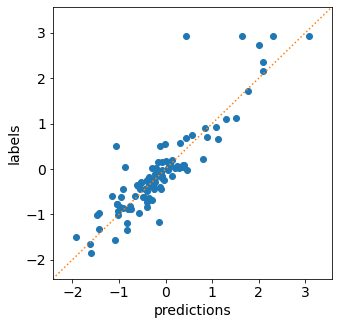
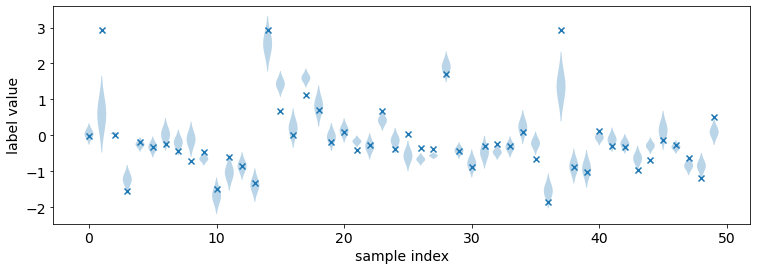
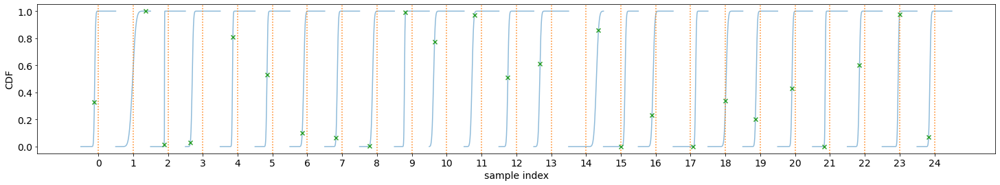
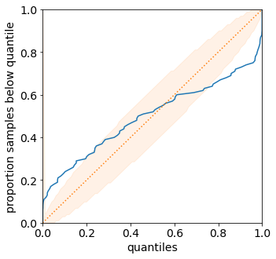
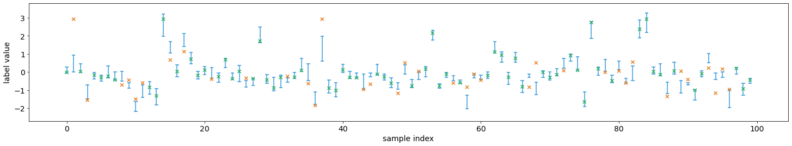
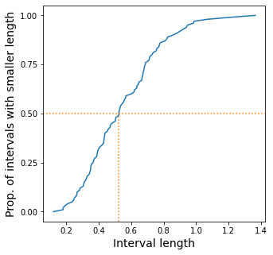
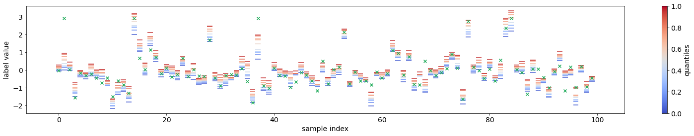
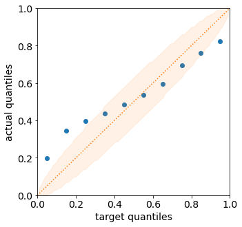

Tutorial 1.a: Representing and Evaluating Uncertainty for Regression
====================================================================

This tutorial is the first in a series of tutorials on using torchuq for
uncertainty quantification. If you haven’t already, you can read the
`Introduction <https://github.com/TorchUQ/torchuq/tree/main/examples/tutorial/0_introduction.md>`__
to understand the overall flow and objective of these tutorials.

Before we start to work with any predictions we must first think about
how to represent our prediction. For example, when predicting the price
of a house, we might want to represent it as a single number (point
prediction), such as 120k dollars, or we might want to represent it as a
cumulative density function (CDF). Each representation has its pros and
cons. Depending on the different requirements during
training/deployment, we might even want to convert between different
representations. For example, we might initially start from an ensemble
prediction (i.e. a set of predictions) possibly because we trained
multiple prediction models, then convert it into a cumulative density
function prediction or a point prediction (which are more interpretable
and easier to work with). Conversion is one of the main features of
torchuq, and we will come back to this topic in a later tutorial.

This notebook aims to introduce some of the popular representations for
regression, and metrics to measure the quality of the prediction. We
first list the types of predictions currently supported by torchuq for
regression. You can skip this part and come back later as a reference.

+------------------+------------------------+---------------+---------+
| Name             | Variable type/shape    | Special       | torchuq |
|                  |                        | requirement   | sub-mod |
|                  |                        |               | ule     |
|                  |                        |               | for     |
|                  |                        |               | evaluat |
|                  |                        |               | ion     |
+==================+========================+===============+=========+
| Point            | ``array [batch_size] w |               | ``torch |
|                  | ith float32/64 dtype`` |               | uq.eval |
|                  |                        |               | uate.po |
|                  |                        |               | int``   |
+------------------+------------------------+---------------+---------+
| Distribution     | Python class that      |               | ``torch |
|                  | behaves like           |               | uq.eval |
|                  | ``torch.distributions. |               | uate.di |
|                  | Distribution``         |               | stribut |
|                  |                        |               | ion``   |
+------------------+------------------------+---------------+---------+
| Interval         | ``array [batch_size, 2 |               | ``torch |
|                  | ]``                    |               | uq.eval |
|                  |                        |               | uate.in |
|                  |                        |               | terval` |
|                  |                        |               | `       |
+------------------+------------------------+---------------+---------+
| Quantile         | ``array [batch_size, n | The quantiles | ``torch |
|                  | um_quantile, 2]``      | should be     | uq.eval |
|                  | or                     | sorted,       | uate.qu |
|                  | ``[batch_size, num_qua | e.g. predicti | antile` |
|                  | ntile]``               | on[i,         | `       |
|                  |                        | j]            |         |
|                  |                        | :math:`\leq`  |         |
|                  |                        | prediction[i, |         |
|                  |                        | j+1]          |         |
+------------------+------------------------+---------------+---------+
| Particle         | ``array [batch_size, n |               | ``torch |
|                  | um_particle]``         |               | uq.eval |
|                  |                        |               | uate.pa |
|                  |                        |               | rticle` |
|                  |                        |               | `       |
+------------------+------------------------+---------------+---------+
| Ensemble         | ``dict: name -> predic | name must     | Not     |
|                  | tion``                 | start with    | availab |
|                  |                        | prediction    | le      |
|                  |                        | type and a    |         |
|                  |                        | string (with  |         |
|                  |                        | no special    |         |
|                  |                        | characters),  |         |
|                  |                        | such as       |         |
|                  |                        | ‘point_1’     |         |
+------------------+------------------------+---------------+---------+

Torchuq uses mandatory batching. For example, a point prediction
variable (which is an array with shape ``[batch_size]``) represents a
sequence of predictions on a dataset with ``batch_size`` many samples.
Even if the dataset only contains 1 sample (i.e. ``batch_size=1``), the
predictions must be an array of shape ``[1]`` rather than a scalar.

Running example
---------------

As a running example we will predict the housing prices on the Boston
housing prices dataset. For convenience, we have pretrained a set of
predictions. In the next chapters we will see how to use torchuq to
learn these predictions from data (hint: it only takes a few lines of
code). But for now let’s just load the pretrained predictions for
visualization.

.. code:: python

    import torch  
    from matplotlib import pyplot as plt
    
    # Make sure that the torchuq package is in PYTHONPATH
    # If you are running this notebook in the original directory as in the repo, then the following statement should work
    import sys
    sys.path.append('../..')   # Include the directory that contains the torchuq package
    
    reader = torch.load('pretrained/boston_pretrained.tar')  # Load the pretrained predictions
    labels = reader['labels']   # Load the true label (i.e. the ground truth housing prices)

1. Point Predictions
--------------------

Point prediction is the simplest type of prediction, where we use a
single number to represent the prediction. Point predictions are
widespread because of their simplicity — a single number is easy to
communicate and interpret. However, point predictions do not represent
the uncertainty in the prediction.

A point prediction is represented by an torch array of shape
``[batch_size]``. Here we load the pretrained point prediction and print
its shape.

.. code:: python

    predictions_point = reader['predictions_point']
    print(predictions_point.shape)

.. parsed-literal::

    torch.Size([101])

There are many ways to visualize or measure the quality of a point
prediction. Here we explain several common ones.

**Scatter plot** visualizes the relationship between the prediction and
the label. On the x-axis we plot the predicted value, and on the y-axis
we plot the true label. If the prediction is perfect, then all points
should lie on the diagonal line (i.e. predicted value = true label). In
torchuq this is accomlished by the ``plot_scatter`` function.

.. code:: python

    from torchuq.evaluate import point    # All point prediction metrics and visualizations are included in the torchuq.metric.point sub-package. 
    point.plot_scatter(predictions_point, labels);

**Scoring Rules** The classic way to evaluate a point prediction is to
compute scoring rules [1].

    **A Detour into the Theory of Scoring Rules**

    Suppose we make a prediction :math:`y` and observe true label
    :math:`Y`. How do we quantitatively evaluate how good or bad the
    prediction is? A function that evaluates prediction quality is
    usually called a scoring rule :math:`s`, which is a map
    :math:`s: y, Y \mapsto s(y, Y) \in \mathbb{R}`. An example scoring
    rule is the L2 score: :math:`s_{\text{L2}}(y, Y) = (y - Y)^2`.
    Intuitively, a high score indicates a poor prediction, and a low
    score indicates a good prediction. However, the exact meaning of
    good vs. poor prediction is ambiguous. The key issue is that a point
    prediction is never “perfect” if there is any uncertainty. If we
    predict :math:`y` while the true label is distributed according to
    the random variable :math:`Y`, then we can never have :math:`y = Y`
    almost surely (unless :math:`Y` is a deterministic random variable).
    For example, the median and the mean of :math:`Y` might be
    different, one practitioner might want to predict the median, and
    another practitioner might want to predict the mean. The two goals
    are inherently conflictory.

    To resolve the ambiguity we can specify the prediction target [1].
    For example, we can aim to predict the mean, and design a scoring
    function that is small (i.e. indicates a good prediction) if the
    prediction :math:`y` is “close” to the mean :math:`\mathbb{E}[Y]`.
    More generally, let :math:`d_Y` denote the probability law of the
    random variable :math:`Y`, we specify some functional
    :math:`F: d_Y \mapsto \mathbb{R}` and aim to predict
    :math:`\mathbb{F}(d_Y)`. In the previous example, :math:`\mathbb{F}`
    is the mean functional :math:`\mathbb{F}(d_Y) = \mathbb{E}(Y)`. We
    say that a scoring rule :math:`s` elicits :math:`\mathbb{F}` if the
    score is small whenever :math:`y \approx \mathbb{F}(d_Y)` and large
    whenever :math:`y \not\approx \mathbb{F}(d_Y)`. Formally this is
    defined by

    .. math::  \mathbb{E}[s(\mathbb{F}(d_Y), Y)] \leq \mathbb{E}[s(y, Y)], \forall y 

    i.e. no prediction :math:`y` can achieve a smaller expected score
    than the desired prediction :math:`F(d_Y)`. Many functionals have
    simple scoring rules that elicit them, as shown in the table below:

    .. raw:: html

       <table>

    .. raw:: html

       <tr>

    .. raw:: html

       <th>

    Functional

    .. raw:: html

       </th>

    .. raw:: html

       <th>

    Scoring rule

    .. raw:: html

       </th>

    .. raw:: html

       <th>

    .. raw:: html

       </th>

    .. raw:: html

       </tr>

    .. raw:: html

       <tr>

    .. raw:: html

       <th>

    Mean

    .. raw:: html

       </th>

    .. raw:: html

       <th>

    L2 score

    .. raw:: html

       </th>

    .. raw:: html

       <th>

    :math:`s(x, y) = (x - y)^2`

    .. raw:: html

       </th>

    .. raw:: html

       <tr>

    .. raw:: html

       <tr>

    .. raw:: html

       <th>

    Median

    .. raw:: html

       </th>

    .. raw:: html

       <th>

    MAE score

    .. raw:: html

       </th>

    .. raw:: html

       <th>

    :math:`s(x, y) = \left\lvert x - y\right\rvert`

    .. raw:: html

       </th>

    .. raw:: html

       <tr>

    .. raw:: html

       <tr>

    .. raw:: html

       <th>

    :math:`\alpha`-quantile

    .. raw:: html

       </th>

    .. raw:: html

       <th>

    Pinball/hinge score

    .. raw:: html

       </th>

    .. raw:: html

       <th>

    :math:`s(x, y) = \left\lbrace \begin{array}{ll} \alpha (y - x) & y > x \\ (1 - \alpha) (x - y) & y \leq x \end{array} \right.`

    .. raw:: html

       </th>

    .. raw:: html

       </tr>

    .. raw:: html

       <tr>

    .. raw:: html

       <th>

    Unnamed

    .. raw:: html

       </th>

    .. raw:: html

       <th>

    Huber loss

    .. raw:: html

       </th>

    .. raw:: html

       <th>

    :math:`s(x, y) = \left\lbrace \begin{array}{ll} (x - y)^2/2 & |x - y| \leq \delta \\ |x - y| \delta - \delta^2/2 & |x - y| > \delta \end{array}\right.`

    .. raw:: html

       </th>

    .. raw:: html

       </tr>

    .. raw:: html

       </table>

    For example, the typical L2 loss used in most regression problems
    elicit the mean functional. In other words, it rewards a prediction
    :math:`y` that equals the expectation :math:`E[Y]` (conditioned on
    all observed variables) but may penalize a prediction that equals
    the median or mode. Not all functionals have a scoring rule that
    elicit them. For example, the conditional value at risk (cVaR) [1]
    cannot be elicited by any score. In general, it is difficult to know
    if a functional can be elicited or not. There are some necessary
    *or* sufficient conditions (but no necessary *and* sufficient
    condition is known to the author’s knowledge).

In torchuq common scoring rules are implemented with the
``compute_scores`` function. This function returns a dictionary with
many common scores.

.. code:: python

    scores = point.compute_scores(predictions_point, labels)
    print(scores)

.. parsed-literal::

    {'L2': tensor(0.1933), 'Huber': tensor(0.0591), 'pinball_0.1': tensor(0.1191), 'pinball_0.2': tensor(0.1244), 'pinball_0.3': tensor(0.1298), 'pinball_0.4': tensor(0.1351), 'pinball_0.5': tensor(0.1404), 'pinball_0.6': tensor(0.1457), 'pinball_0.7': tensor(0.1510), 'pinball_0.8': tensor(0.1563), 'pinball_0.9': tensor(0.1616), 'MAE': tensor(0.1404)}

2. Distribution Predictions
---------------------------

A distribution prediction is a cumulative distribution function (CDF)
over the label, i.e. it is a function :math:`f: \mathbb{R} \to [0, 1]`
that is monotonic and upward continuous. Ideally, a distribution
prediction :math:`f` should predict the true probability :math:`f(c) =
\text{Pr}[Y \leq c], \forall c` although this is
usually very difficult to achieve exactly [2,3]. Distribution
predictions are very informative. For example, if we want to predict the
price of a house, then a CDF prediction would specify the (predicted)
probability of each possible price value.

Torchuq inherits the pytorch interface for representing a distribution,
i.e. a distribution prediction is represented by any class that inherits
the
`torch.distributions.distribution.Distribution <https://pytorch.org/docs/stable/distributions.html>`__
interface. Duck typing is also supported (i.e. the class only has to
behave like
`torch.distributions.distribution.Distribution <https://pytorch.org/docs/stable/distributions.html>`__).
Here we load the pretrained distribution prediction and verify that it
has the correct type.

.. code:: python

    predictions_distribution = reader['predictions_distribution']
    print(predictions_distribution)
    print(type(predictions_distribution))

.. parsed-literal::

    Normal(loc: torch.Size([101]), scale: torch.Size([101]))
    <class 'torch.distributions.normal.Normal'>

There are several metrics and visualizations available for distribution
predictions:

**Density Visualization** A way to intuitively visualize a distribution
prediction is to visualize its `probability density
function <https://en.wikipedia.org/wiki/Probability_density_function>`__
(when it exists). In torchuq this is achieved by
``distribution.plot_density_sequence`` which takes as input a batch of
distribution predictions, and plots the density for each prediction. The
x-axis is the index of the prediction in the batch.

**CDF Visualization** We can also visualize the cumulative density
function (CDF) of the distribution prediction. This is particularly
useful when density visualzation fails. For example, not all
distributions have a density because the CDF could be dis-continnuous.
In torchuq, visualizing the CDF is accomplished by the
``distribution.plot_cdf_sequence`` function.

.. code:: python

    from torchuq.evaluate import distribution     # All distribution prediction metrics and visualizations are included in the torchuq.metric.point sub-package. 
    # Pass in the optional argument "labels" to plot the true labels in the same diagram
    # max_count is the maximum number of distributions to plot. Set a reasonable number (such as 50-100) to avoid cluttering the visualization. 
    distribution.plot_density_sequence(predictions_distribution, labels, max_count=50)
    distribution.plot_cdf_sequence(predictions_distribution, labels, max_count=25);

**Scoring Rules** To evaluate the quality of distribution predictions,
we can use proper scoring rules.

    **Another Detour into the Theory of Scoring Rules**

    Let :math:`f^*` be the true CDF of :math:`Y`. A proper scoring rule
    is any function that returns small (expected) values when the
    predicted CDF :math:`f` is close to the true CDF :math:`f^*`, and
    large values otherwise. Formally a proper scoring function is a map
    :math:`s: f, Y \mapsto s(f, Y) \in \mathbb{R}` that satisfies

    .. math::  \mathbb{E}[s(f^*, Y)] \leq \mathbb{E}[s(f, Y)], \forall \text{ CDF } f

    In other words, no CDF can achieve a smaller score than the true CDF
    :math:`f^*` (in expectation). Scoring rules for distribution
    predictions are usually different from scoring rules for point
    predictions.

    There are many common proper scoring rules. Two commonly used
    scoring rules are

    .. raw:: html

       <ul>

    .. raw:: html

       <li>

    The negative log likelihood (NLL), defined by
    :math:`s_{\text{NLL}}(f, y) = -\log f'(y)`. Log likelihood is only
    defined when :math:`f` is differentiable (i.e. has a density
    function).

    .. raw:: html

       </li>

    .. raw:: html

       <li>

    The continuous ranked probability score (CRPS), defined by
    :math:`s_{\text{CRPS}}(f, y) = \int (f(x) - \mathbb{I}(x \geq y))^2 dx`.
    Unlike NLL, CRPS is defined even when :math:`f` is not
    differentiable.

    .. raw:: html

       </li>

    .. raw:: html

       </ul>

In torchuq, scoring rules are implemented by functions such as
``distribution.compute_crps`` or ``distribution.compute_nll``. If the
score is not defined then these functions will return nan.

.. code:: python

    crps = distribution.compute_crps(predictions_distribution, labels).mean()
    nll = distribution.compute_nll(predictions_distribution, labels).mean()
    print("CRPS score is %.4f, nll score is %.4f " % (crps, nll))

.. parsed-literal::

    CRPS score is 0.2276, nll score is 2.5124 

The following code demonstrates the fact that CRPS/NLL are proper
scoring rules. If we try to predict a less accurate distribution (for
example by intentionally shifting the predicted distribution), then the
CRPS/NLL score will increase.

.. code:: python

    # Try computing the crps for a worse predictive distribution 
    import copy
    bad_prediction = copy.deepcopy(predictions_distribution)
    bad_prediction.loc += 0.5
    crps = distribution.compute_crps(bad_prediction, labels).mean()
    nll = distribution.compute_nll(bad_prediction, labels).mean()
    print("CRPS score is %.4f, nll score is %.4f " % (crps, nll))

.. parsed-literal::

    CRPS score is 0.4767, nll score is 18.2165 

**Reliability Diagram and Calibration** An important property for
distribution prediction is (probabilistic) calibration [4, 5]. The idea
behind calibration is that a probabilistic prediction should reflect the
true distribution; for instance, 90% of the labels should be below the
predicted 90% quantile. Formally let :math:`F` be the random variable
that denotes our prediction. (Notation clarification: in the previous
discussion, we use :math:`f` to denote a single distribution prediction;
however it is only meaningful to talk about probabilistic calibration
for a set/batch of predictions. Here we should think of :math:`F` a
randomly selected prediction from the set/batch, and :math:`Y` is the
label associated with the selected prediction.) Perfect probabilistic
calibration is defined by

.. math:: \Pr[Y \leq F^{-1}(\alpha)] = \Pr[F(Y) \leq \alpha] = \alpha, \forall \alpha \in [0, 1] 

Probabilitic calibration is only one of many calibration properties for
distribution predictions. For additional calibration notions see [2].

To measure probabilistic calibration we can compute the deviation from
perfect probabilistic calibration. There are two typical tools

1. **ECE metrics** measures the average difference between the left hand
   side (LHS) and the right hand side (RHS) of equation above.

   .. math::  \int_0^1 |\Pr[F(Y) \leq \alpha] - \alpha| d\alpha 

2. **Reliability diagram** plots the map from
   :math:`\alpha \mapsto \Pr[F(Y) \leq \alpha]`. If the predictor is
   perfectly calibrated, then the map should be the identity map. In
   torchuq use ``distribution.plot_reliability_diagram`` to plot the
   reliability diagram. Because of statistical fluctuations, a predictor
   that is perfectly probabilistically calibrated (on the entire
   population, or given infinite data) might be uncalibrated on a finite
   dataset. Torchuq will also automatically compute the 99% confidence
   interval. If the recalibration diagram falls outside the confidence
   interval, then it very likely that the predictor is not calibrated on
   the entire population either.

.. code:: python

    # ECE estimation is biased, if you enable the debiased option, then the expected ECE will be 0 for a perfectly calibrated predictor
    ece = distribution.compute_ece(predictions_distribution, labels, debiased=True) 
    print("Debiased ECE is %.3f" % ece)
    distribution.plot_reliability_diagram(predictions_distribution, labels);

.. parsed-literal::

    Debiased ECE is 0.069

From the above ECE and reliability diagram, we can see that the
predictions are not calibrated. We will discuss recalibration in a
future tutorial.

3. Interval Predictions
-----------------------

There are situations where some uncertainty quantification is needed
(hence a point prediction is insuffient), but we do not want to learn a
full cumulative distribution function. An interval prediction is a good
intermediate representation that can quantify uncertainty but is not too
complex. An interval prediction consists of a lower bound and an upper
bound (denote by :math:`L`, :math:`U`). For example, an interval
prediction can be “the price is between 120k and 150k. Such simple
predictions are often easier to visualize and communicate to the general
public.

We say that an interval is valid if :math:`Y \in [L, U]` and say that a
(batch) of interval predictions have :math:`c`-coverage if :math:`c`
proportion of the intervals are valid.

In torchuq, interval predictions are represented as an array of shape
``[batch_size, 2]`` where ``prediction[i, 0]`` denotes the lower bound
of the :math:`i`-th prediction and ``prediction[i, 1]`` denotes the
upper bound of the :math:`i`-th prediction. Here we load the example
interval prediction and verify that it has the right shape.

.. code:: python

    predictions_interval = reader['prediction_interval']
    print(predictions_interval.shape)

.. parsed-literal::

    torch.Size([101, 2])

**Direct Visualization** We provide a function to directly visualize an
interval prediction. The different colors indicate whether the interval
prediction is valid or not (i.e. if the label belongs to the predicted
interval).

.. code:: python

    from torchuq.evaluate import interval 
    interval.plot_interval_sequence(predictions_interval, labels)

.. parsed-literal::

    <AxesSubplot:xlabel='sample index', ylabel='label value'>

**Length and Coverage** Two important metrics for (a batch of) interval
predictions are its length and coverage. You can use the function
``compute_length`` and ``compute_coverage`` to compute the average
length and coverage.

We can also plot the distribution of the lengths, i.e. we might want to
know how many proportion of the intervals have a size that’s less than
0.3, 0.5, etc. This can be accomlished by the function
``plot_length_cdf``.

.. code:: python

    length = interval.compute_length(predictions_interval)
    coverage = interval.compute_coverage(predictions_interval, labels)
    print("Length is %.3f, coverage is %.3f" % (length, coverage))
    interval.plot_length_cdf(predictions_interval);

.. parsed-literal::

    Length is 0.549, coverage is 0.624

4. Quantile Predictions
-----------------------

Similar to interval predictions, quantile predictions are most useful
when some uncertainty quantification is needed (hence a point prediction
is insuffient), but we do not want to learn a full cumulative
distribution function. An example quantile prediction is: “There is 10%
chance that the housing price is less than 120k, and 90% chance that
it’s less than 150k.

In torchuq a quantile prediction is represented as an array of shape
``[batch_size, num_quantiles, 2]`` where ``prediction[:, :, 0]`` is the
**quantiles values** (e.g. 120k, 150k), and ``prediction[:, :, 1]`` is
the **quantile probability** (e.g. 10%, 90%). For example, to represent
our example price prediction, we can use an array ``prediction`` of
shape ``[1, 2, 2]``, and set
``prediction[0, 0, 0] = 120k, prediction[0, 0, 1] = 0.1, prediction[0, 1, 0] = 150k, prediction[0, 1, 1] = 0.9``.
Again, we use mandatory batching, the batch dimension is necessary even
if ``batch_size=1`` in this example.

As a convenient shorthand, we can drop the quantile probabilities, and
represent a quantile prediction as an array of shape
``[batch_size, num_quantiles]`` (only the quantile values are
specified). The quantile probabilities are defined implicitly by the
shape of the array (i.e. the value of ``num_quantiles``). It is
implicitly defined as
:math:`\frac{1}{2 * \text{num quantiles}}, \frac{3}{2 * \text{num quantiles}}, \cdots, \frac{2 * \text{num quantiles}-1}{2 * \text{num quantiles}}`.
For example, if ``num_quantiles=10`` then the quantile probabilities are
implicitly defined as :math:`0.05, 0.15, \cdots, 0.95`.

Here we load the pretrained quantile predictions and verify that it has
the correct shape. We use the implicit representation (with shape
``[batch_size, num_quantiles]``).

.. code:: python

    predictions_quantile = reader['predictions_quantile']
    print(predictions_quantile.shape)   # Here the quantiles are implicitly defined

.. parsed-literal::

    torch.Size([101, 10])

There are several metrics and visualizations available for quantile
predictions:

**Quantile Visualization** We can directly plot the quantile
predictions. Torchuq provides a function
``quantile.plot_quantile_sequence`` where the different quantile
probabilities are rendered in different color. For example, in the plot
below the red colors are the upper quantiles (e.g. 95%) quantile, and
the blue colors are the lower quantiles (e.g. 5% quantile). If the true
label is also provided, it is plotted as green crosses. The x-axis is
the index of the samples (e.g. ``predictions[0], predictions[1],``
:math:`\cdots`).

.. code:: python

    from torchuq.evaluate import quantile 
    quantile.plot_quantile_sequence(predictions_quantile, labels);

**Quantile calibration** Similar to a CDF prediction, a quantile
prediction should also satisfy calibration, e.g. 90% of the labels
should be below the predicted 90% quantile. The quantile calibration
diagram is almost the same as the reliability diagram (for distribution
predictions). In torchuq we can plot a quantile calibration diagram by
``quantile.plot_quantile_calibration``.

.. code:: python

    quantile.plot_quantile_calibration(predictions_quantile, labels)

.. parsed-literal::

    <AxesSubplot:xlabel='target quantiles', ylabel='actual quantiles'>

In this case, the prediction is not calibrated. For example, the
bottom-left dot shows that about 20% of the labels are below the 5%
predicted quantile. We will discuss calibrating quantiles in a later
tutorial.

**Scoring rules** Similar to other types of predictions we discussed
above, quantile predictions also have (proper) scoring rules.
Intuitively a proper scoring rule should be small if the predicted
quantile value equals the true quantile value, and large otherwise. For
quantile predictions, a very important proper scoring rule is the
**pinball loss** (also called the hinge loss).

The following is an example of the pinball loss implemented in torchuq.

.. code:: python

    pinball = quantile.compute_pinball_loss(predictions_quantile, labels).mean()
    print("Pinball loss is %.3f" % pinball)

.. parsed-literal::

    Pinball loss is 0.111

References
----------

[1] Gneiting, Tilmann. “Making and evaluating point forecasts.” Journal
of the American Statistical Association 106, no. 494 (2011): 746-762.

[2] Vovk, Vladimir, Alex Gammerman, and Glenn Shafer. Algorithmic
learning in a random world. Springer Science & Business Media, 2005.

[3] Zhao, Shengjia, Tengyu Ma, and Stefano Ermon. “Individual
calibration with randomized forecasting.” In International Conference on
Machine Learning, pp. 11387-11397. PMLR, 2020.

[4] Gneiting, Tilmann, and Matthias Katzfuss. “Probabilistic
forecasting.” Annual Review of Statistics and Its Application 1 (2014):
125-151.

[5] Kuleshov, Volodymyr, Nathan Fenner, and Stefano Ermon. “Accurate
uncertainties for deep learning using calibrated regression.” In
International Conference on Machine Learning, pp. 2796-2804. PMLR, 2018.
