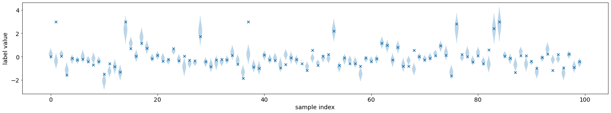
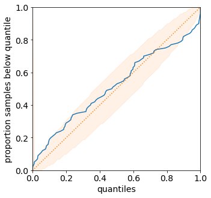
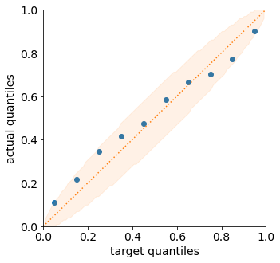
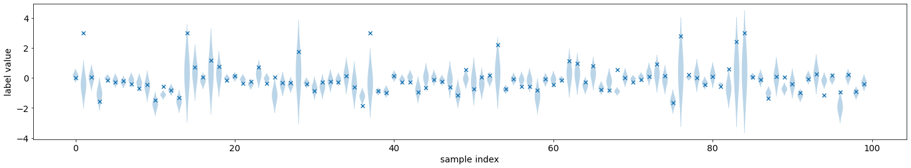
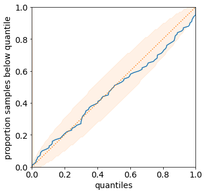

Tutorial 1.b: Learning Uncertainty Representations from Data with Gradient Descent
==================================================================================

In the previous tutorial we demonstrated several types of predictions
and metrics to measure their quality. Naturally, given a quality
measurement we can also optimize the predictions to maximize the quality
measure. This tutorials demonstrates how to access the large number of
inbuilt datasets in torchuq and use torchuq metrics to train a model on
these datasets.

Most of the tutorial will follow the standard deep learning pipeline.
The only difference is that the torchuq metrics used as training
objectives. In torchuq, most metrics are differentiable, so they can be
directly used as objective functions and optimized with gradient
descent. To see which metrics are differentiable see the reference list
in [TBD].

Setting up the Environment
~~~~~~~~~~~~~~~~~~~~~~~~~~

We first setup the environment of the tutorial. First load the necessary
dependencies.

.. code:: python

    from matplotlib import pyplot as plt
    import torch
    from torch import optim, nn
    from torch.nn import functional as F
    from torch.utils.data import DataLoader
    from torch.distributions.normal import Normal
    
    import sys
    sys.path.append('../..')
    import torchuq 
    
    # device = torch.device('cuda:0')  # Use this option if you have GPU
    device = torch.device('cpu')  

**Dataset**: We will use the UCI boston dataset. For your convenience
torchuq includes a large collection of benchmark datasets with a single
interface ``torchuq.dataset.regression.get_regression_datasets`` or
``torchuq.dataset.classification.get_classification_datasets``. All the
data files are included with the repo, so you should be able to use
these datasets out-of-the-box. For a list of available datasets see
`link <https://github.com/ShengjiaZhao/torchuq/tree/main/torchuq/dataset>`__.
In addition to these simple datasets, there are also some larger
datasets that require manual download of the data files. To access these
datasets see [link].

An example usage to retrieve the simple datasets is

``train_dataset, val_dataset, test_dataset = torchuq.dataset.regression.get_regression_datasets(dataset_name, val_fraction=0.2, test_fraction=0.2, split_seed=0)``

You can split the data into train/val/test by setting non-zero values to
the arguments ``val_fraction`` and ``test_fraction``. You can optionally
specify the random seed used in the data splitting by ``split_seed``.
The return values are pytorch Dataset instances, which can be
conveniently used with pytorch dataloaders.

.. code:: python

    from torchuq.dataset.regression import get_regression_datasets
    train_dataset, val_dataset, _ = get_regression_datasets('boston', val_fraction=0.2, test_fraction=0.0, verbose=True)
    
    x_dim = len(train_dataset[0][0])   # Get the dimension of the input features
    train_loader = DataLoader(train_dataset, batch_size=32, shuffle=True, num_workers=1)
    
    # Get the validation features and labels and move them to correct device
    val_x, val_y = val_dataset[:]    
    val_x, val_y = val_x.to(device), val_y.to(device)

.. parsed-literal::

    Loading dataset boston....
    Splitting into train/val/test with 405/101/0 samples
    Done loading dataset boston

**Prediction Model**: For simplicity, we use a 3 layer fully connected
neural network as the prediction function.

.. code:: python

    class NetworkFC(nn.Module):
        def __init__(self, x_dim, out_dim=1, num_feat=30):
            super(NetworkFC, self).__init__()
            self.fc1 = nn.Linear(x_dim, num_feat)
            self.fc2 = nn.Linear(num_feat, num_feat)
            self.fc3 = nn.Linear(num_feat, out_dim)
            
        def forward(self, x):
            x = F.leaky_relu(self.fc2(F.leaky_relu(self.fc1(x))))
            return self.fc3(x)

Learning Probability Predictions
~~~~~~~~~~~~~~~~~~~~~~~~~~~~~~~~

We can define a probability prediction model by mapping each input to
the parameters of a distribution family (such as Gaussians). For
example, the following code defines a prediction model that outputs
Gaussian distributions. It is a network that outputs both the mean and
standard deviation of the Gaussian distribution.

.. code:: python

    net = NetworkFC(x_dim, out_dim=2).to(device)
    
    pred_raw = net(val_x) 
    pred_val = Normal(loc=pred_raw[:, 0], scale=pred_raw[:, 1].abs())

To learn the parameters of the prediction model, we can use any proper
scoring rule. Recall from the previous tutorial: given a prediction
:math:`q`, and if the true label is :math:`Y` with (unknown)
distribution :math:`p_Y`, then a proper scoring rule is any function
that satisfies :math:`\mathbb{E}[s(p_Y, Y)]
\leq \mathbb{E}[s(q, Y)]`. Intuitively,
predicting the correct distribution :math:`q = p_Y` minimizes the proper
scoring rule.

In our example we minimize the CRPS score. It could be replaced by the
negative log likelihood (NLL) or any other proper scoring rule, and the
results shouldn’t be fundamentally changed.

.. code:: python

    from torchuq.evaluate.distribution import compute_crps 
    
    optimizer = optim.Adam(net.parameters(), lr=5e-4)
    
    for epoch in range(50):
        # Evaluate the validation set performance
        if epoch % 10 == 0:    
            with torch.no_grad():  
                pred_raw = net(val_x) 
                pred_val = Normal(loc=pred_raw[:, 0], scale=pred_raw[:, 1].abs())
                loss = compute_crps(pred_val, val_y)  
                print("Epoch %d, loss=%.4f" % (epoch, loss))
        
        # Standard pytorch training loop
        for i, (bx, by) in enumerate(train_loader):  
            optimizer.zero_grad()
            pred_raw = net(bx.to(device)) 
            pred = Normal(loc=pred_raw[:, 0], scale=pred_raw[:, 1].abs())
            loss = compute_crps(pred, by.to(device)) 
            loss.backward()
            optimizer.step()

.. parsed-literal::

    Epoch 0, loss=0.6456
    Epoch 10, loss=0.3775
    Epoch 20, loss=0.2954
    Epoch 30, loss=0.2719
    Epoch 40, loss=0.2620

We can visualize the predicted distributions on the validation set.
These are the same functions that were introduced in the previous
tutorial.

.. code:: python

    from torchuq.evaluate.distribution import plot_density_sequence, plot_reliability_diagram
    
    # Record the quantile predictions on the validation set
    pred_raw = net(val_x).detach() 
    predictions_distribution = Normal(loc=pred_raw[:, 0], scale=pred_raw[:, 1].abs())
    
    plot_density_sequence(predictions_distribution, val_y)
    plot_reliability_diagram(predictions_distribution, val_y);

Learning Quantile Predictions
~~~~~~~~~~~~~~~~~~~~~~~~~~~~~

Learning quantile predictions is very similar to learning distribution
predictions. There are two differences: the prediction should have the
correct shape ``[batch_size, n_quantiles]`` or
``[batch_size, n_quantiles, 2]``, and we must use a proper scoring rule
for quantiles. For the proper scoring rule we use the pinball loss,
which is minimized if and only if the predicted quantiles matches the
true quantiles.

.. code:: python

    from torchuq.evaluate.quantile import compute_pinball_loss
    
    net = NetworkFC(x_dim, out_dim=10).to(device)
    optimizer = optim.Adam(net.parameters(), lr=5e-4)
    
    for epoch in range(50):
        # Evaluate the validation set performance
        if epoch % 10 == 0:    
            with torch.no_grad():  
                val_x, val_y = val_dataset[:]
                pred_val = net(val_x.to(device))
                loss = compute_pinball_loss(pred_val, val_y.to(device))
                print("Epoch %d, loss=%.4f" % (epoch, loss))
        
         # Standard pytorch training loop
        for i, (bx, by) in enumerate(train_loader): 
            optimizer.zero_grad()
            pred = net(bx.to(device))
            loss = compute_pinball_loss(pred, by.to(device))
            loss.backward()
            optimizer.step()

.. parsed-literal::

    Epoch 0, loss=0.3521
    Epoch 10, loss=0.2042
    Epoch 20, loss=0.1498
    Epoch 30, loss=0.1366
    Epoch 40, loss=0.1311

.. code:: python

    from torchuq.evaluate.quantile import plot_quantile_sequence, plot_quantile_calibration
    
    # Record the quantile predictions on the validation set
    predictions_quantile = net(val_x.to(device)).cpu().detach()
    
    plot_quantile_sequence(predictions_quantile, val_y);
    plot_quantile_calibration(predictions_quantile, val_y)

.. image:: output_15_0.png

Using Torchuq Transforms in an End-to-End Deep Learning Pipeline
----------------------------------------------------------------

One of the key functionality of Torchuq is **transformation**,
i.e. converting a prediction into a different prediction. For example, a
simple transformation is to convert a distribution prediction into an
interval prediction. There is a very natural conversion: we simply take
a credible interval of the predicted distribution. For a list of simple
transformations see [TBD]. There are also sophisticated transformations
(that we will introduce in the future tutorials), such as transforming
ensemble predictions into calibrated distributions.

In this tutorial we focus on end-to-end learning, and aim to show that
most transformations in torchuq are differentiable, so can be
incorporated into a deep learning pipeline as a network layer. As an
example, the function
``torchuq.transform.direct.quantile_to_distribution`` converts a
quantile prediction to a distribution prediction by fitting a kernel
density estimator; it is a differentiable function. For demonstration
purposes, we first predict a quantile prediction, then convert it to a
distribution prediction, and finally optimize a proper scoring rule
(negative log likelihood) on the distribution prediction.

.. code:: python

    from torchuq.transform.direct import quantile_to_distribution
    from torchuq.evaluate.distribution import compute_crps, compute_nll
    
    net = NetworkFC(x_dim, out_dim=10).to(device)
    optimizer = optim.Adam(net.parameters(), lr=5e-4)
    
    for epoch in range(50):
        if epoch % 10 == 0:    # Evaluate the validation performance
            with torch.no_grad():  
                pred_raw = net(val_x.to(device)) 
                pred_val = quantile_to_distribution(pred_raw)
    
                loss = compute_nll(pred_val, val_y.to(device)) 
                print("Epoch %d, loss=%.4f" % (epoch, loss))
        
        for i, (bx, by) in enumerate(train_loader):  # Standard pytorch training loop
            optimizer.zero_grad()
            pred_raw = net(bx.to(device)) 
            pred_val = quantile_to_distribution(pred_raw)
            
            loss = compute_nll(pred_val, by.to(device))
            loss.backward()
            optimizer.step()

.. parsed-literal::

    Epoch 0, loss=2.7785
    Epoch 10, loss=1.1145
    Epoch 20, loss=0.9336
    Epoch 30, loss=1.3190
    Epoch 40, loss=1.7267

.. code:: python

    from torchuq.evaluate.distribution import plot_density_sequence, plot_reliability_diagram
    
    pred_raw = net(val_x.to(device)).cpu()
    predictions_distribution2 = quantile_to_distribution(pred_raw)
    
    plot_density_sequence(predictions_distribution2, val_y)
    plot_reliability_diagram(predictions_distribution2, val_y);

