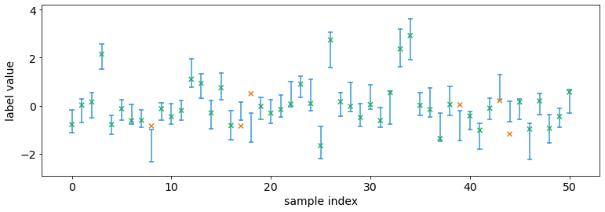
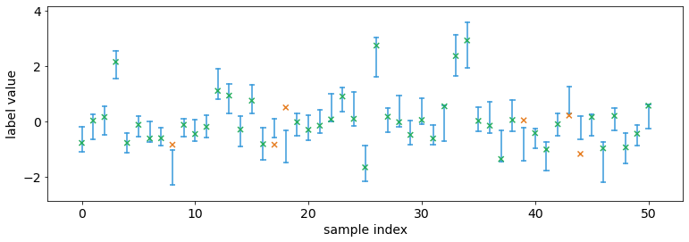
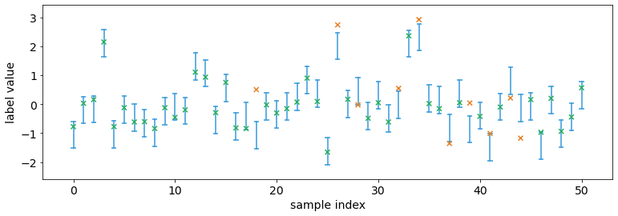
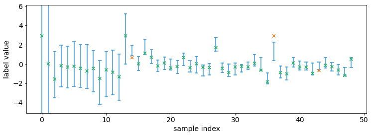
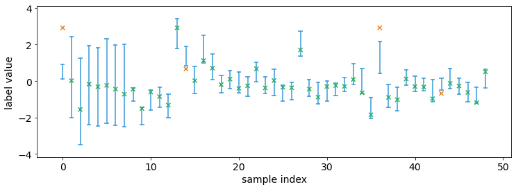

Tutorial 1.c.1 Conformal (Interval) Prediction: From any Prediction to Valid Intervals
======================================================================================

1. Offline Conformal Prediction
-------------------------------

One of the basic requirement for an interval prediction is **coverage**.
For example, an interval prediction has 95% coverage if the true label
belongs to the predicted interval for 95% of the samples. In this
tutorial we will show how to generate interval predictions with provably
correct coverage. In particular, we assume we also have some type of
prediction (it could be any type of predictions such as point/ensemble),
and we would like to transform such predictions into interval
predictions.

The technique we use is called conformal prediction. We will focus on
how to use conformal prediction (rather than how it works, which are
introduced in many tutorials such as
`SV <https://jmlr.csail.mit.edu/papers/volume9/shafer08a/shafer08a.pdf>`__
or
`AB <https://people.eecs.berkeley.edu/~angelopoulos/blog/posts/gentle-intro/>`__).
We will think of conformal prediction as a (black box) algorithm that
take as input a batch of original predictions (that can be any type
including ensembles) and outputs a batch of interval predictions. Of
course, there is no magic without data — conformal prediction algorithm
needs to a batch of labeled validation data (i.e. a batch of original
prediction / label pair). However, conformal prediction is extremely
data efficient, and typically only require less than 50 samples (unless
we want extremely high coverage).

The main workhorse for conformal prediction is the class
``torchuq.transform.conformal.ConformalIntervalPredictor``. We first
import it the class, as well as some test prediction data (same as
tutorial 1.a).

.. code:: python

    # As before we first setup the environment and load the test prediction
    import sys
    sys.path.append('../..')   # Include the directory that contains the torchuq package
    import torch  
    from matplotlib import pyplot as plt
    
    reader = torch.load('pretrained/boston_pretrained.tar')  # Load the pretrained predictions
    
    # Split the data into validation and test, in this example we will use quantile predictions as the original predictions
    val_preds = reader['predictions_quantile'][:50]
    val_labels = reader['labels'][:50]   # Load the true label (i.e. the ground truth housing prices)
    test_preds = reader['predictions_quantile'][50:]
    test_labels = reader['labels'][50:]  # Used for testing
    
    from torchuq.transform.conformal import ConformalIntervalPredictor

To use ``ConformalIntervalPredictor`` there are only three functions
that you need to know

1. Constructor:
   ``calibrator = ConformalIntervalPredictor(input_type='quantile')``,
   there is only one required argument, which is the prediction type, it
   is one of the types introduced in tutorial 1.a.

2. Train: ``ConformalIntervalPredictor.train(val_preds, val_labels)``
   trains the conformal predictor based on validation predictions and
   validation labels

3. Test:
   ``test_intervals = ConformalIntervalPredictor.__call__(test_preds)``
   outputs the valid interval predictions

.. code:: python

    calibrator = ConformalIntervalPredictor(input_type='quantile', coverage='exact')
    calibrator.train(val_preds, val_labels)
    test_intervals = calibrator(test_preds, confidence=0.9)

We can visualize the intervals. Observe that approximately 90% of the
labels are within the predicted confidence interval, which is equal to
our ``confidence=0.9``. This is not a conincidence, as conformal
prediction can guarantees coverage if the data is i.i.d. (in fact, it
only requires exchangeability).

.. code:: python

    from torchuq.evaluate import interval
    interval.plot_interval_sequence(test_intervals, test_labels)

There is an argument called ``coverage`` when creating the
ConformalIntervalPredictor class. If you choose ``coverage=exact`` then
the intervals have perfectly correct coverage in expectation (the
probability that the label belongs to a predicted interval is *exactly*
equal to ``confidence``). If you choose ``coverage=1/N`` then the
coverage is :math:`0.9 \pm 1/N` where :math:`N` is the number of
validation samples.

What’s the trade-off? Typically you get smaller intervals if
``coverage=1/N`` compared to ``coverage=exact``. For example, the
following code uses ``coverage=1/N`` and the intervals are smaller. In
fact, if you use ``coverage=exact`` and have less than ``1/confidence``
validation samples, the calibrator might predict an infinitely large
interval and output :math:`[-\infty, +\infty]`. On the other hand, if
you choose ``coverage=1/N`` then the calibrator will never predict an
infinitely large interval.

.. code:: python

    calibrator = ConformalIntervalPredictor(input_type='quantile', coverage='1/N')
    calibrator.train(val_preds, val_labels)
    test_intervals = calibrator(test_preds, confidence=0.9)
    interval.plot_interval_sequence(test_intervals, test_labels)

We used quantile predictions as an example. Note that we could use any
prediction type as input. The following example uses point predictions

.. code:: python

    # Split the data into validation and test, in this example we will use quantile predictions as the original predictions
    val_preds = reader['predictions_point'][:50]
    test_preds = reader['predictions_point'][50:]
    calibrator = ConformalIntervalPredictor(input_type='point', coverage='1/N')   # The only difference from before is that the input_type is different
    calibrator.train(val_preds, val_labels)
    test_intervals = calibrator(test_preds, confidence=0.9)
    interval.plot_interval_sequence(test_intervals, test_labels)

2. Online Conformal Prediction
------------------------------

In many applications, the data come in as a continuous stream. For
example, we might make a prediction every day for tomorrow’s weather.
After predicting tomorrow’s weather, we observe the true label before
making a prediction for the-day-after-tomorrow’s weather. Torchuq
supports this mode of prediction as well.

To make online predictions, the only new function you will need to know
is ``calibrator.update(predictions, labels)``. This functions works
almost identically as ``calibrator.train`` except it keeps the previous
validation data, while ``calibrator.train`` removes all validation data
and starts anew. The following example shows how to make online
predictions.

.. code:: python

    calibrator = ConformalIntervalPredictor(input_type='quantile', coverage='exact')
    
    val_preds = reader['predictions_quantile'][:50]
    val_labels = reader['labels'][:50]   # Load the true label (i.e. the ground truth housing prices)
    
    def simulate_online(calibrator):
        # There needs to be at least 1 data point before making any prediction 
        calibrator.train(val_preds[0:1], val_labels[0:1])
    
        prediction_history = []
        for t in range(1, 50): 
            test_interval_t = calibrator(val_preds[t:t+1], confidence=0.9)  # Make a prediction for the new time step
            calibrator.update(val_preds[t:t+1], val_labels[t:t+1])   # Update the calibrator based on the observed label
            
            prediction_history.append(test_interval_t)
    
        # Concat the interval predictions for plotting 
        prediction_history = torch.cat(prediction_history)
        return prediction_history
    
    prediction_history = simulate_online(calibrator)
    interval.plot_interval_sequence(prediction_history, val_labels[1:50])

Notably initially when there are very few observed data points, the
intervals are very large. This is because we selected
``coverage='exact'``. If we do not require exact coverage then the
interval sizes can be much smaller.

.. code:: python

    calibrator = ConformalIntervalPredictor(input_type='quantile', coverage='1/N')
    
    prediction_history = simulate_online(calibrator)
    interval.plot_interval_sequence(prediction_history, val_labels[1:50])

In fact, torchuq supports even more general prediction problems. For
example, we might make a prediction for the weather 7 days from today.
We will only observe the true label after 7 predictions. This is often
called online learning with delayed feedback. This can be achieved by
calling the ``calibrator.update`` function when the feedback arrives.
