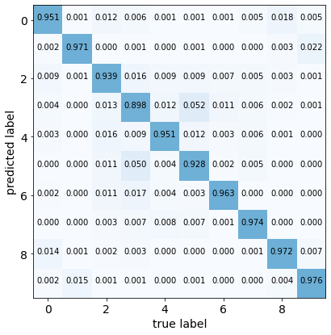
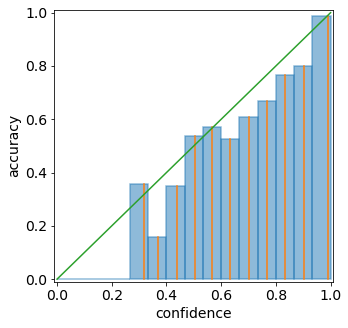

Tutorial 2.a: Representing and Evaluating Uncertainty for Classification
========================================================================

The structure of this tutorial will mirror that of Tutorial 1.a.
Tutorial 1.a focuses on regression problems, while the current tutorial
focuses on classification problems.

Before we start to work with any predictions, we must first think about
how to represent our prediction. For example, when predicting image
classes, we can represent the prediction as a categorical distribution
over all possible labels, or as a set of likely labels. Each
representation has its pros and cons. Depending on the different
requirements during training/deployment, we may even want to convert
between different representations.

This notebook aims to introduce some popular representations, as well as
metrics to measure the quality of the predictions.

We first list the types of predictions currently supported by torchuq
for classification. You can skip this part and come back later as a
reference.

+-------------------+------------------------+-------------+----------+
| Name              | Variable type/shape    | Special     | torchuq  |
|                   |                        | requirement | sub-modu |
|                   |                        |             | le       |
|                   |                        |             | for      |
|                   |                        |             | evaluati |
|                   |                        |             | on       |
+===================+========================+=============+==========+
| Topk              | ``int array [batch_siz | Each        | ``torchu |
|                   | e] or [batch_size, k]` | element     | q.evalua |
|                   | `                      | take values | te.topk` |
|                   |                        | in          | `        |
|                   |                        | ``{0, 1, .. |          |
|                   |                        | ., num_clas |          |
|                   |                        | ses}``      |          |
+-------------------+------------------------+-------------+----------+
| Categorical       | ``float32  array [batc | Elements    | ``torchu |
|                   | h_size, num_classes]`` | should be   | q.evalua |
|                   |                        | in          | te.categ |
|                   |                        | :math:`[0,  | orical`` |
|                   |                        | 1]`         |          |
|                   |                        | and sum to  |          |
|                   |                        | :math:`1`   |          |
+-------------------+------------------------+-------------+----------+
| USet              | ``int array [batch_siz | Elements    | ``torchu |
|                   | e, num_classes]``      | are 0 or 1  | q.evalua |
|                   |                        |             | te.uset` |
|                   |                        |             | `        |
+-------------------+------------------------+-------------+----------+
| Ensemble          | ``dict: name -> predic | name must   | Unavaila |
|                   | tion``                 | start with  | ble      |
|                   |                        | prediction  |          |
|                   |                        | type and a  |          |
|                   |                        | string      |          |
|                   |                        | (with no    |          |
|                   |                        | special     |          |
|                   |                        | characters) |          |
|                   |                        | ,           |          |
|                   |                        | such as     |          |
|                   |                        | ‘categorica |          |
|                   |                        | l_1’        |          |
+-------------------+------------------------+-------------+----------+

.. code:: python

    # We must first import the dependencies, and make sure that the torchuq package is in PYTHONPATH
    # If you are running this notebook in the original directory as in the repo, then the following statement should work
    import sys
    sys.path.append('../..')   # Include the directory that contains the torchuq package
    import torch  
    from matplotlib import pyplot as plt

As a running example, we will use existing predictions for CIFAR-10. We
first load these predictions.

.. code:: python

    
    reader = torch.load('pretrained/resnet18-cifar10.pt')
    
    # These functions transform categorical predictions into different types of predictions
    # We will discuss transformations later, but for now we will simply use it to generate our example predictions
    from torchuq.transform.direct import *
    predictions_categorical = reader['categorical']
    predictions_uset = categorical_to_uset(reader['categorical'])
    predictions_top1 = categorical_to_topk(reader['categorical'], 1)
    predictions_top3 = categorical_to_topk(reader['categorical'], 3)
    labels = reader['labels']

1. Top-k Prediction
~~~~~~~~~~~~~~~~~~~

The simplest type of prediction specifies the top-k labels (i.e. the k
most likely predicted labels). The labels are represented as integers
:math:`\lbrace 0, 1, \cdots, \text{n classes}-1 \rbrace`. A batch of
top-k prediction is represented by an integer array of shape
``[batch_size, k]``, where ``predictions[i, :]`` is a sequence of labels
(which are represented as integers). A top-1 prediction can be either
represented as an array of shape ``[batch_size, 1]`` or more
conveniently as an array of shape ``[batch_size]``.

Here, we first verify that the loaded top3 and top1 predictions have the
correct shape.

.. code:: python

    print(predictions_top1.shape)
    print(predictions_top3.shape)

.. parsed-literal::

    torch.Size([10000])
    torch.Size([10000, 3])

A very natural way to visualize the quality of a top-1 prediction is by
the confusion matrix: among the samples that are predicted as class
:math:`i`, how many of them actually belong to class :math:`j`. To plot
a confusion matrix in torchuq use
``torchuq.evaluate.topk.plot_confusion_matrix``.

.. code:: python

    from torchuq.evaluate import topk
    topk.plot_confusion_matrix(predictions_top1, labels);

We can also evaluate metrics for these predictions, such as accuracy

.. code:: python

    print(topk.compute_accuracy(predictions_top1, labels))
    print(topk.compute_accuracy(predictions_top3, labels))

.. parsed-literal::

    tensor(0.9524)
    tensor(0.9951)

2. Categorical Prediction
~~~~~~~~~~~~~~~~~~~~~~~~~

The categorical prediction is perhaps the most useful prediction type
for classification. This type of prediction returns the probability that
a label is correct for each possible label. In torchuq a categorical
prediction is represented as a float array of shape
``[batch_size, n_classes]``, where ``predictions[i, j]`` is the
probability that the :math:`i`-th sample takes the :math:`j`-th label.

.. code:: python

    print(predictions_categorical.shape)

.. parsed-literal::

    torch.Size([10000, 10])

**Confidence Calibration**. Given a categorical prediction
:math:`p \in [0, 1]^{\text{n classes}}`, the confidence of the
prediction is the largest probability in the array: :math:`\max_i p_i`.
If this largest probability is close to 1, then the prediction is highly
confident. A simple but important requirement for this type of
prediction is confidence calibration: among the samples with confidence
:math:`c`, the top-1 accuracy should also be :math:`c`. For instance, if
a model is 90% confident in each of 100 predictions, it should predict
the correct label for 90 of the samples. If this property doesn’t hold,
then these confidence estimates are not meaningful.

We can visualize confidence calibration by plotting the reliability
diagram, which plots the (actual) accuracy :math:`a` among samples with
predicted confidence :math:`c` vs. the predicted confidence :math:`c`.
Ideally the predicted confidence :math:`c` will be equal to the actual
accuracy :math:`a`, so a perfectly calibrated model will yield a
diagonal :math:`a=c` line. Deviations from this line represent
miscalibration. As an example, we plot the reliability diagram for our
example predictions below, and it is clear that the predictions are not
well-calibrated. For example, among all samples with a confidence of
about 0.9, the accuracy is only about 0.8. Hence the accuracy is lower
than the confidence, and the predictions are over-confident.

We can also compute the expected calibration error (ECE), which is a
single number that measures mis-calibration. The ECE measures the
average deviation from the ideal :math:`a=c` line. In practice, the ECE
is approximated by binning — partitioning the predicted confidences into
bins, and then taking a weighted average of the difference between the
accuracy and average confidence for each bin. Pictorially, it is the
average distance between the blue bars and the diagonal in the
reliability diagram below.

.. code:: python

    from torchuq.evaluate import categorical
    categorical.plot_reliability_diagram(predictions_categorical, labels, binning='uniform');
    print('ECE-error is %.4f' % categorical.compute_ece(predictions_categorical, labels, num_bins=15))

.. parsed-literal::

    ECE-error is 0.0277

3. Uncertainty Set Prediction
~~~~~~~~~~~~~~~~~~~~~~~~~~~~~

The next type of representation is (uncertainty) set predictions.
Uncertainty sets are almost the same as top-k; the main difference is
that for top-k predictions, k must be specificed a priori, while for
uncertainty sets, k can be different for each sample. In torchuq,
uncertainty set predictions are represented by an integer array of shape
``[batch_size, n_classes]``, where ``predictions[i, j] = 1`` indicates
that the :math:`i`-th sample includes the :math:`j`-th label in its
uncertainty set, and ``predictions[i, j] = 0`` indicates that it is not.

For set predictions, there are two important properties to consider:

-  The coverage: the frequency with which the true label belongs to the
   predicted set. A high coverage means that the true label almost
   always belong to the predicted set.

-  The set size: the number of elements in the prediction set

Ideally, we would like high coverage with a small set size. We compute
the coverage and the set size of the example predictions below.

.. code:: python

    from torchuq.evaluate import uset
    
    coverage = uset.compute_coverage(predictions_uset, labels)
    size = uset.compute_size(predictions_uset)
    print("The coverage is %.3f, average set size is %.3f" % (coverage, size))

.. parsed-literal::

    The coverage is 0.987, average set size is 1.268
