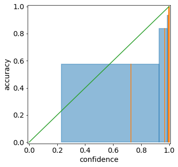
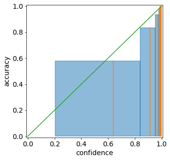
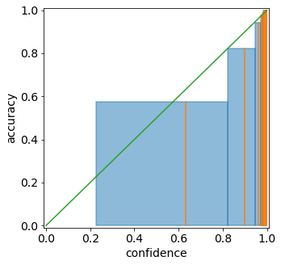

Tutorial 2.b: Learning Calibrated Probabilities: The Basics
===========================================================

Calibration is a basic requirement for probabilistic predictions.
However, many classification models are not intrinsically
well-calibrated. Thus, there exist several methods that apply a
post-processing adjustment to the classifier to improve the model’s
calibration. In this tutorial we will cover some basic recalibration
techniques.

.. raw:: html

   <!-- Recalibration methods are a set of post-processing techniques for adjusting predicted probabilities to make them better calibrated. -->

.. code:: python

    # We must first import the dependencies, and make sure that the torchuq package is in PYTHONPATH
    # If you are running this notebook in the original directory as in the repo, then the following statement should work
    import sys
    sys.path.append('../..')   # Include the directory that contains the torchuq package
    import torch  
    from matplotlib import pyplot as plt

.. code:: python

    reader = torch.load('pretrained/resnet18-cifar10.pt')
    predictions = reader['categorical']
    labels = reader['labels']

Most calibration algorithms are in the ``torchuq.transform.calibrate``
module, with the exception of decision calibration, which is in the
``torchuq.transform.decision`` module.

.. code:: python

    from torchuq.evaluate import categorical
    from torchuq.transform.calibrate import *

Torchuq implements many recalibration algorithms. Below is a list of
currently supported algorithms:

-  Standard calibration methods: temperature scaling, histogram binning
-  Classwise calibration methods: dirichlet recalibration
-  Advanced calibration methods: Decision calibration

Standard Calibration Methods
----------------------------

Temperature Scaling
~~~~~~~~~~~~~~~~~~~

Temperature scaling is a recalibration method for neural networks that
learns a single temperature parameter and rescales the confidence scores
for all samples simultaneously.

For each input :math:`x`, a neural network typically first computes a
logit score :math:`l_1(x), \dots, l_n` for each of the :math:`n`
possible classes. It then applies a softmax function to compute the
confidence score:

.. math::  \hat{p}(x) = \max_i \frac{e^{l_i(x)}}{\sum_j e^{l_j(x)}} 

Temperature scaling simply adds a temperature parameter :math:`T` to the
softmax function:

.. math::  \hat{p}(x, T) = \max_i \frac{e^{l_i(x)/T}}{\sum_j e^{l_j(x)/T}} 

A higher temperature (:math:`T>1`) will reduce the confidence, and a
lower temperature (:math:`T<1`) will increase the confidence. :math:`T`
is trained to minimize the standard cross entropy loss on a validation
dataset. Note that the *accuracy* of the classifier will not change —
the relative ordering of the :math:`n` possible classes will remain the
same, so the predicted class will remain the same. Only the *confidence*
of the predicted class will change.

Despite its simplicity, temperature scaling performs well empirically in
classification calibration for deep neural networks [1].

In torchuq, all calibrator classes work in essentially the same way, so
this may sound familiar if you have seen the tutorial for regression. In
particular, to use ``TemperatureScaling`` there are only three functions
that you need to know:

1. Constructor: ``calibrator = TemperatureScaling``.

2. Train: ``TemperatureScaling.train(val_preds, val_labels)`` trains the
   predictor based on validation predictions and validation labels

3. Test: ``test_intervals = TemperatureScaling(test_preds)`` outputs the
   recalibrated predictions

.. code:: python

    categorical.plot_reliability_diagram(predictions, labels);

.. code:: python

    calibrator = TemperatureScaling(verbose=True)
    calibrator.train(predictions, labels)
    predictions_ts = calibrator(predictions)

.. parsed-literal::

    _change_device is deprecated 
    Iteration 0, lr=0.00100, NLL=0.178
    Iteration 100, lr=0.00100, NLL=0.170
    Iteration 200, lr=0.00100, NLL=0.165
    Iteration 300, lr=0.00100, NLL=0.163
    Iteration 400, lr=0.00100, NLL=0.162
    Iteration 500, lr=0.00100, NLL=0.162
    Iteration 600, lr=0.00100, NLL=0.162
    Iteration 700, lr=0.00050, NLL=0.162
    _change_device is deprecated 

.. code:: python

    categorical.plot_reliability_diagram(predictions_ts, labels);

Histogram Binning
~~~~~~~~~~~~~~~~~

Histogram binning is another popular recalibration method for
classification models. Histogram binning partitions the confidence
scores into bins
:math:`\{[0, \epsilon), [\epsilon, 2\epsilon), \cdots, [1-\epsilon, 1] \}`,
and sorts each validation sample into a bin based on its predicted
confidence. It then resets the confidence score for each element in a
bin to match the average classification accuracy of elements in that
bin.

With torchuq, it is extremely easy to use a different recalibration
method — simply replace the TemperatureScaling class with the
HistogramBinning class. In this case, histogram binning appears to
achieve better calibration than temeprature scaling, as shown in the
visualized reliability diagram.

.. code:: python

    calibrator = HistogramBinning(verbose=True)
    calibrator.train(predictions, labels)
    predictions_hb = calibrator(predictions)
    categorical.plot_reliability_diagram(predictions_hb, labels);

.. parsed-literal::

    Top-1 accuracy of predictor is 0.952
    Number of histogram binning bins is 20
    tensor([-1.0000,  0.8616,  0.9733,  0.9918,  0.9962,  0.9977,  0.9983,  0.9986,
             0.9988,  0.9990,  0.9991,  0.9992,  0.9992,  0.9993,  0.9994,  0.9994,
             0.9995,  0.9996,  0.9996,  0.9997,  2.0000])

.. image:: output_12_1.png

Classwise Calibration Methods
-----------------------------

Sometimes, overall confidence calibration is insufficient. In many
applications, we may instead want to achieve the stronger notion of
*classwise* calibration. Classwise calibration groups samples by their
true class label, and considers the ECE within each class; this may be
useful (for instance) for ensuring that different groups are similarly
well calibrated.

Dirichlet Calibration
~~~~~~~~~~~~~~~~~~~~~

One method for achieving classwise calibration is Dirichlet calibration
[2]. This method learns a calibration map that transforms the predicted
probabilities based on a Dirichlet probability distribution. In neural
networks, it can be implemented as additional layers: a logarithmic
transformation followed by a fully connected layer with softmax
activation.

.. code:: python

    calibrator = DirichletCalibrator(verbose=True)
    calibrator.train(predictions, labels)
    predictions_dc = calibrator(predictions)
    categorical.plot_reliability_diagram(predictions_dc, labels);

.. parsed-literal::

    _change_device is deprecated 
    Finished training 0 epochs, lr=0.00100, nll = 4.563, reg = 3.135
    Finished training 10 epochs, lr=0.00100, nll = 0.457, reg = 2.039
    Finished training 20 epochs, lr=0.00100, nll = 0.231, reg = 1.139
    Finished training 30 epochs, lr=0.00100, nll = 0.187, reg = 0.574
    Finished training 40 epochs, lr=0.00100, nll = 0.170, reg = 0.287
    Finished training 50 epochs, lr=0.00100, nll = 0.162, reg = 0.145
    Finished training 60 epochs, lr=0.00100, nll = 0.158, reg = 0.083
    Finished training 70 epochs, lr=0.00100, nll = 0.155, reg = 0.051
    Finished training 80 epochs, lr=0.00100, nll = 0.154, reg = 0.043
    Finished training 90 epochs, lr=0.00100, nll = 0.152, reg = 0.039
    Finished training 100 epochs, lr=0.00100, nll = 0.151, reg = 0.039
    Finished training 110 epochs, lr=0.00050, nll = 0.150, reg = 0.042
    Finished training 120 epochs, lr=0.00013, nll = 0.150, reg = 0.043
    Finished training 130 epochs, lr=0.00006, nll = 0.150, reg = 0.042
    Finished training 140 epochs, lr=0.00003, nll = 0.150, reg = 0.042
    _change_device is deprecated 

Advanced Calibration Methods
----------------------------

Decision Calibration
~~~~~~~~~~~~~~~~~~~~

[TBD]

References
----------

[1] Chuan Guo, Geoff Pleiss, Yu Sun, and Kilian Weinberger. “On
Calibration of Modern Neural Networks.” International Conference on
Machine Learning (2017).

[2] Meelis Kull, Miquel Perello-Nieto, Markus Kängsepp, Telmo Silva
Filho, Hao Song, and Peter Flach. “Beyond temperature scaling: Obtaining
well-calibrated multiclass probabilities with Dirichlet calibration.”
NeurIPS (2019).
